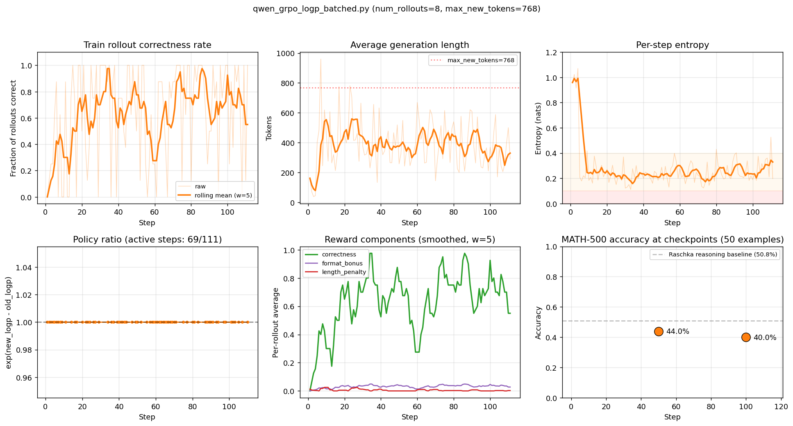
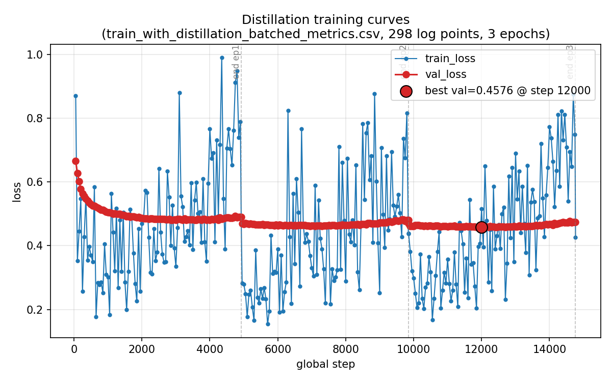

# qwen3-nano-math-reasoner

Two post-training experiments on **Qwen3-0.6B-base** for MATH-500 reasoning, both
starting from the same base model and evaluated on the same 500-problem held-out
benchmark:

1. **GRPO** — RL with verifiable reward
2. **SFT distillation** — supervised fine-tuning on DeepSeek V4 Pro reasoning traces

This is based on learning exercises from *Reasoning From Scratch* by Sebastian Raschka.

## Headline result

Full MATH-500 (n=500), `max_new_tokens=4096`, greedy decoding.

| Method | Approach | Accuracy |
|---|---|---:|
| Qwen3-0.6B base | no fine-tuning (floor) | 16.0% |
| GRPO (this repo, step 100) | RL, 100 steps × 8 rollouts | 40.0%* |
| **SFT distillation (this repo)** | 12K DeepSeek V4 Pro traces, 3 epochs | **34.6%** |
| Qwen3-0.6B reasoning | Qwen's officially-released reasoning variant (ceiling) | 60.4% |

\* GRPO accuracy is from a 50-problem MATH-500 subset evaluated mid-training; the full 500-problem eval is pending. The distillation, base, and Qwen reasoning numbers are from the full 500.

Full breakdown including per-difficulty accuracy and solution overlap: [`remote_artifacts/eval_summary.md`](remote_artifacts/eval_summary.md)

## Approach 1: GRPO

The reward signal is a 0/1 correctness check on `\boxed{...}` answers, plus a small
correctness-conditional format bonus and an unconditional length penalty for
saturating responses. Sampling is sequential (batch=1 per rollout) because of some weird inconsistencies caused when batching sampling as the kernel changes when bs>1. This seems to
have to do with sensitivity of smaller model and less robust inferenece implementation in `reasoning_from_scratch` package. More details
should be available on my blog[ToUpdate]

### GRPO training curves



The training loop ran for 111 steps (interrupted before the planned 500) with held-out
MATH-500 evaluations on a 50-example subset at two checkpoints:

| Step | MATH-500 acc | Correct | Train correctness (last 10) | Train reward (last 10) |
|---|---|---|---|---|
| 50  | **44.0%** | 22/50 | 0.725 | 0.761 |
| 100 | **40.0%** | 20/50 | 0.775 | 0.814 |

Training-rollout correctness on in-distribution problems climbed from 0.725 to 0.775
between the two checkpoints, but held-out eval accuracy moved in the opposite direction.
This is the canonical train/eval gap that shows up in cold-start RLVR on small base models.
The model rapidly masters the training-set problem distribution; that mastery does
not transfer one-for-one to held-out problems.

The 500 evaluation problems are explicitly excluded from the training pool (the source
dataset is named `math_full_minus_math500`).

### Reward shape

```python
correctness   = 1.0 if extracted == ground_truth else 0.0
format_bonus  = 0.05 if (correctness and \boxed{} present) else 0.0
length_penalty = 0.1 if gen_len > 0.8 * max_new_tokens else 0.0

reward = correctness + format_bonus - length_penalty
```

Two design choices worth noting:

1. **Format bonus is conditional on correctness.** Independent positive reward for
   emitting `\boxed{}` is exploitable and the policy will learn to emit `\boxed{N}`
   immediately with no reasoning to claim it. Making the bonus contingent on
   actually solving the problem removes the gaming attractor.
2. **Length penalty is unconditional.** It fires whenever a rollout saturates at
   `0.8 × max_new_tokens`, regardless of correctness, so the policy is
   discouraged from rambling whether right or wrong.

### GRPO run command

This is according to the hyperparams that were used for the main run:

```bash
python qwen_grpo_logp_batched.py \
  --steps 500 \
  --num_rollouts 8 \
  --max_new_tokens 768 \
  --clip_eps 0.2 \
  --kl_coeff 0.02 \
  --inner_epochs 1 \
  --format_bonus_weight 0.05 \
  --length_penalty_weight 0.1 \
  --length_penalty_threshold_frac 0.8 \
  --skip-zero-advantage-updates \
  --eval_on_checkpoint 50 \
  --show_eta
```

Key sanity check: `policy_ratio` should print as `1.0000` on every active step (the
gradient is on-policy under `inner_epochs=1`). If it drifts away from 1.0 with no
parameter updates between sampling and loss computation, something is biasing the
log-probability estimator.

## Approach 2: SFT distillation

Distill DeepSeek V4 Pro's chain-of-thought traces into Qwen3-0.6B-base via supervised
fine-tuning. The teacher generates explicit `<think>...</think>` reasoning traces over
the MATH train set; the student learns to imitate the format and the reasoning style.

### Distillation training curves



Training landed at **val_loss 0.474** after 3 epochs, with the best checkpoint at step
12,000 (mid-epoch 3, val_loss 0.458). Mild overfitting in the late steps suggests epoch
2 may have been the optimal stopping point — worth re-evaluating that checkpoint if
you want to squeeze the headline number.

### Distillation pipeline

Three stages, each runnable independently:

```bash
# 1. Generate teacher traces (DeepSeek V4 Pro API, ~1.5 hours, ~$15 with promo)
DEEPSEEK_API_KEY=sk-... python generate_distill_data.py \
    --math_json math_train.json \
    --dataset_size 12000 \
    --num_processes 16 \
    --max_new_tokens 16384 \
    --out_file math_train_v4pro_12k.json \
    --resume

# 2. Train (~107 min on a single H100 80GB)
python qwen_distill.py \
    --data_path math_train_v4pro_12k.json \
    --max_seq_len 2048 \
    --batch_size 2 \
    --epochs 3 \
    --log_every 50 \
    --lr 1e-5 \
    --grad_clip_norm 1.0 \
    --use_think_tokens

# 3. Eval the distilled checkpoint and the two baselines on MATH-500
python evaluate_math500.py --which_model reasoning \
    --checkpoint_path checkpoints/qwen_distill/qwen3-0.6B-dsv4pro-math500-distill-step14766-epoch3.pth \
    --dataset_size 500 --max_new_tokens 4096 --device cuda \
    --out_path eval_distilled.jsonl
python evaluate_math500.py --which_model base \
    --dataset_size 500 --max_new_tokens 4096 --device cuda \
    --out_path eval_base.jsonl
python evaluate_math500.py --which_model reasoning \
    --dataset_size 500 --max_new_tokens 4096 --device cuda \
    --out_path eval_qwen_reasoning.jsonl

# 4. Aggregate into a comparison table
python compare_evals.py
```

A few notes on the workflow:

- **`--use_think_tokens`** loads the reasoning tokenizer (chat template + `<think>` formatting). Distilled checkpoints trained with this flag must be evaluated with `--which_model reasoning` so the prompt format at inference matches training.
- **The 12K source problems are MATH train, disjoint from MATH-500.** No train/eval contamination.
- **Sequence-length cap of 2048** keeps 9,847 / 12,000 rows. Higher caps preserve more long traces but multiply attention activation memory quadratically (the model's manual softmax materializes the full N×N score matrix per layer).
- **Greedy decoding at eval** for reproducibility; the same setting is used across all three models for a fair comparison.

### Total cost

| Stage | Resource | Time | Cost |
|---|---|---:|---:|
| Distillation data generation | DeepSeek V4 Pro API, 16× parallel | ~1.5 hours | ~$15 |
| Training | 1× H100 80GB | 107 min | ~$5 |
| Evaluation (3 models × 500 problems) | 1× H100 80GB | ~6.5 hours | ~$20 |
| **Total** | | **~10 hours** | **~$40-45** |

## Files

| File | Purpose |
|---|---|
| **GRPO** | |
| [`qwen_grpo.py`](qwen_grpo.py) | Reference GRPO trainer with sequential sampling and per-rollout logp computation |
| [`qwen_grpo_logp_batched.py`](qwen_grpo_logp_batched.py) | **Production GRPO version.** Sequential sampling + batched logp scoring. |
| [`qwen_grpo_batched.py`](qwen_grpo_batched.py) | Fully-batched GRPO experiment. Diverges in fp32 due to cuBLAS routing batched vs unbatched matmuls through different kernels. Kept for documentation. |
| [`diag_batched.py`](diag_batched.py) | Diagnostic that compares batched vs unbatched first-token logits for the same prompt. Confirmed the kernel-level fp32 divergence. |
| [`plot_runs.py`](plot_runs.py) | Generates GRPO training-curve PNGs and the combined eval table. |
| **SFT distillation** | |
| [`generate_distill_data.py`](generate_distill_data.py) | Parallel DeepSeek V4 Pro trace generator with thinking-mode toggle and resume support. |
| [`qwen_distill.py`](qwen_distill.py) | Batched SFT trainer. Length-sorted batching, prompt-token loss masking, per-epoch checkpoints. |
| [`plot_distill_curves.py`](plot_distill_curves.py) | Loss curves from the SFT metrics CSV. |
| **Shared eval** | |
| [`evaluate_math500.py`](evaluate_math500.py) | MATH-500 grader. Loads any checkpoint via `--checkpoint_path`, writes a JSONL with per-example records. |
| [`compare_evals.py`](compare_evals.py) | Aggregates eval JSONLs across methods into a comparison table with per-difficulty breakdown. |

## Setup

```bash
python -m venv .venv
source .venv/bin/activate
pip install torch reasoning-from-scratch numpy requests sympy tokenizers matplotlib
```

On a CUDA box you may need to pin a torch build matching your driver, e.g.
`pip install torch --index-url https://download.pytorch.org/whl/cu124` for
CUDA 12.4 drivers.

Model weights, tokenizer, and the MATH train/eval data download lazily on
first run via the `reasoning_from_scratch` package. The DeepSeek API key
needs to be set in the `DEEPSEEK_API_KEY` environment variable for the
distillation data generator.

## Reproducing the plots

**GRPO training curves and eval table:**

```bash
python plot_runs.py
```

Reads `remote_artifacts/qwen_grpo_logp_batched/logs/qwen_grpo_logp_batched_metrics.csv`
and writes:

- `remote_artifacts/training_curves_logp_batched.png`
- `remote_artifacts/eval_summary.{md,csv}`

To compare against additional runs, append a new entry to the `RUNS` list at the top
of the script and re-run; the plots and table will pick up the new run automatically.

**Distillation training curves:**

```bash
python plot_distill_curves.py \
    --csv remote_artifacts/qwen_distill/logs/qwen_distill_metrics.csv \
    --out remote_artifacts/training_curves_distill.png
```

**Cross-method comparison table:**

```bash
python compare_evals.py
```

Auto-discovers eval JSONLs under `remote_artifacts/qwen_distill/evals/` (and the GRPO
eval if present) and writes `comparison.csv` to the cwd.
