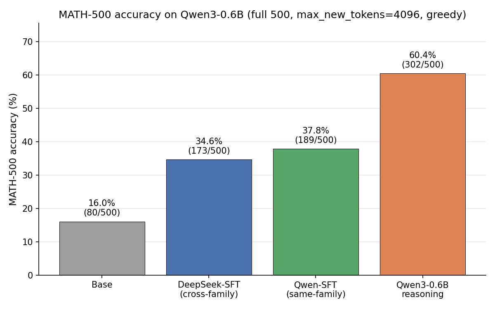
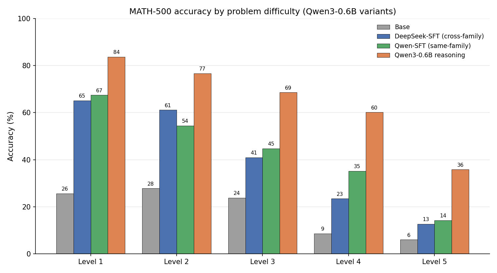
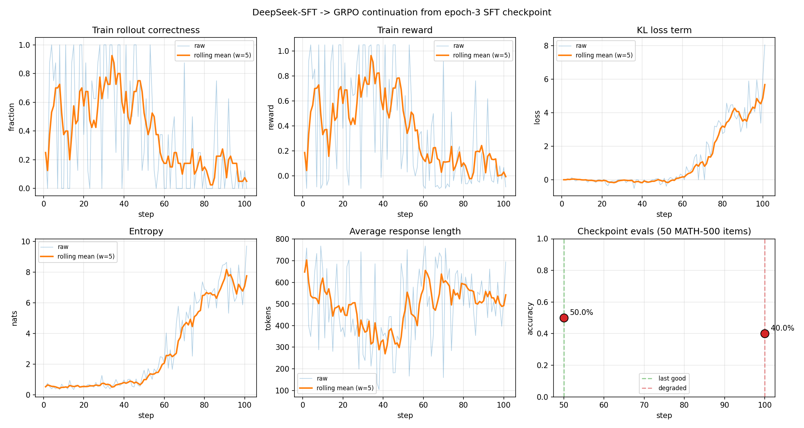
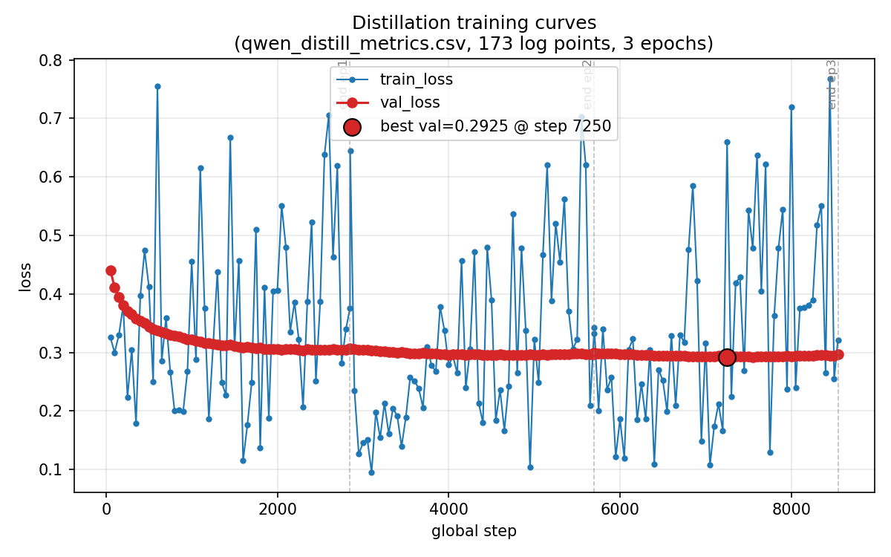

# qwen3-nano-math-reasoner

Post-training experiments on **Qwen3-0.6B-base** for MATH-500 reasoning, all
starting from the same base model and evaluated on the same 500-problem held-out
benchmark:

1. **GRPO** — RL with verifiable reward
2. **SFT distillation from a cross-family teacher** — supervised fine-tuning on DeepSeek V4 Pro reasoning traces
3. **SFT distillation from a same-family teacher** — supervised fine-tuning on Qwen3-235B-A22B reasoning traces

This is based on learning exercises from *Reasoning From Scratch* by Sebastian Raschka, with additional experiments comparing cross-family vs same-family distillation and an SFT-seeded GRPO continuation that go beyond the book.

## Headline result

Full MATH-500 (n=500), `max_new_tokens=4096`, greedy decoding.

| Method | Approach | Accuracy |
|---|---|---:|
| Qwen3-0.6B base | no fine-tuning (floor) | 16.0% |
| GRPO (this repo, step 100) | RL, 100 steps × 8 rollouts | 40.0%* |
| **SFT distillation (this repo)** | 12K DeepSeek V4 Pro traces (cross-family), 3 epochs | **34.6%** |
| **Qwen-SFT distillation (this repo, best-val)** | 12K Qwen3-235B-A22B traces (same-family), `max_seq_len=2048` | **37.8%** |
| **SFT distillation → GRPO (this repo, step 50)** | GRPO continuation from the DeepSeek-distilled checkpoint | **50.0%*** |
| Qwen3-0.6B reasoning | Qwen's officially-released reasoning variant | 60.4% |

\* GRPO accuracies are from a 50-problem MATH-500 subset evaluated mid-training; the full 500-problem evals are pending. The distillation, base, and Qwen reasoning numbers are from the full 500.





Same-family Qwen-SFT pulls ahead of cross-family DeepSeek-SFT on the harder levels (3, 4, 5) but loses on level 2 — consistent with its longer-trace teacher providing more useful supervision for multi-step problems.

Full breakdown including per-difficulty accuracy and solution overlap: [`results/eval_summary.md`](results/eval_summary.md)

## Approach 1: GRPO

The reward signal is a 0/1 correctness check on `\boxed{...}` answers, plus a small
correctness-conditional format bonus and an unconditional length penalty for
saturating responses. Sampling is sequential (batch=1 per rollout) because of some weird inconsistencies caused when batching sampling as the kernel changes when bs>1. This seems to
have to do with sensitivity of smaller model and less robust inferenece implementation in `reasoning_from_scratch` package. More details
should be available on my blog[ToUpdate]

### GRPO training curves


The training loop ran for 111 steps (interrupted before the planned 500) with held-out
MATH-500 evaluations on a 50-example subset at two checkpoints:

| Step | MATH-500 acc | Correct | Train correctness (last 10) | Train reward (last 10) |
|---|---|---|---|---|
| 50  | **44.0%** | 22/50 | 0.725 | 0.761 |
| 100 | **40.0%** | 20/50 | 0.775 | 0.814 |

Training-rollout correctness on in-distribution problems climbed from 0.725 to 0.775
between the two checkpoints, but held-out eval accuracy moved in the opposite direction.
This is the canonical train/eval gap that shows up in cold-start RLVR on small base models.
The model rapidly masters the training-set problem distribution; that mastery does
not transfer one-for-one to held-out problems.

The 500 evaluation problems are explicitly excluded from the training pool (the source
dataset is named `math_full_minus_math500`).

#### Continuation from the SFT-distilled seed



Re-running the same GRPO loop on top of the SFT-distilled checkpoint (epoch 3, 34.6% on full
MATH-500) instead of the base model lifts the step-50 eval from 44.0% to **50.0%** on the same
50-problem subset:

| Step | MATH-500 acc | Correct |
|---|---|---|
| 50  | **50.0%** | 25/50 |
| 100 | 40.0% | 20/50 |

The run was stopped at step 101 once KL and entropy diverged (kl_loss 0.06 → 8.0, entropy
0.5 → 9.7 over the 100 steps) and the eval regressed. `policy_ratio` stayed at 1.0000 on
every active step, so the regression is KL drift against the SFT seed rather than off-policy
bias. Per-step metrics: [`results/sft_deepseek_then_grpo/logs/qwen_grpo_logp_batched_metrics.csv`](results/sft_deepseek_then_grpo/logs/qwen_grpo_logp_batched_metrics.csv).

### Reward shape

```python
correctness   = 1.0 if extracted == ground_truth else 0.0
format_bonus  = 0.05 if (correctness and \boxed{} present) else 0.0
length_penalty = 0.1 if gen_len > 0.8 * max_new_tokens else 0.0

reward = correctness + format_bonus - length_penalty
```

Two design choices worth noting:

1. **Format bonus is conditional on correctness.** Independent positive reward for
   emitting `\boxed{}` is exploitable and the policy will learn to emit `\boxed{N}`
   immediately with no reasoning to claim it. Making the bonus contingent on
   actually solving the problem removes the gaming attractor.
2. **Length penalty is unconditional.** It fires whenever a rollout saturates at
   `0.8 × max_new_tokens`, regardless of correctness, so the policy is
   discouraged from rambling whether right or wrong.

### GRPO run command

This is according to the hyperparams that were used for the main run:

```bash
python src/qwen_grpo.py \
  --steps 500 \
  --num_rollouts 8 \
  --max_new_tokens 768 \
  --clip_eps 0.2 \
  --kl_coeff 0.02 \
  --inner_epochs 1 \
  --format_bonus_weight 0.05 \
  --length_penalty_weight 0.1 \
  --length_penalty_threshold_frac 0.8 \
  --skip-zero-advantage-updates \
  --eval_on_checkpoint 50 \
  --show_eta
```

Key sanity check: `policy_ratio` should print as `1.0000` on every active step (the
gradient is on-policy under `inner_epochs=1`). If it drifts away from 1.0 with no
parameter updates between sampling and loss computation, something is biasing the
log-probability estimator.

## Approach 2: SFT distillation

Distill DeepSeek V4 Pro's chain-of-thought traces into Qwen3-0.6B-base via supervised
fine-tuning. The teacher generates explicit `<think>...</think>` reasoning traces over
the MATH train set; the student learns to imitate the format and the reasoning style.

### Distillation training curves


Training landed at **val_loss 0.474** after 3 epochs, with the best checkpoint at step
12,000 (mid-epoch 3, val_loss 0.458). Mild overfitting in the late steps suggests epoch
2 may have been the optimal stopping point — worth re-evaluating that checkpoint if
you want to squeeze the headline number.

### Distillation pipeline

Three stages, each runnable independently:

```bash
# 1. Generate teacher traces (DeepSeek V4 Pro API, ~1.5 hours, ~$15 with promo)
DEEPSEEK_API_KEY=sk-... python data_gen/generate_distill_data.py \
    --math_json math_train.json \
    --dataset_size 12000 \
    --num_processes 16 \
    --max_new_tokens 16384 \
    --out_file math_train_v4pro_12k.json \
    --resume

# 2. Train (~107 min on a single H100 80GB)
python src/qwen_distill.py \
    --data_path math_train_v4pro_12k.json \
    --max_seq_len 2048 \
    --batch_size 2 \
    --epochs 3 \
    --log_every 50 \
    --lr 1e-5 \
    --grad_clip_norm 1.0 \
    --use_think_tokens

# 3. Eval the distilled checkpoint and the two baselines on MATH-500
python src/evaluate_math500.py --which_model reasoning \
    --checkpoint_path results/sft_deepseek/checkpoints/qwen3-0.6B-dsv4pro-math500-distill-step14766-epoch3.pth \
    --dataset_size 500 --max_new_tokens 4096 --device cuda \
    --out_path eval_distilled.jsonl
python src/evaluate_math500.py --which_model base \
    --dataset_size 500 --max_new_tokens 4096 --device cuda \
    --out_path eval_base.jsonl
python src/evaluate_math500.py --which_model reasoning \
    --dataset_size 500 --max_new_tokens 4096 --device cuda \
    --out_path eval_qwen_reasoning.jsonl

# 4. Aggregate into a comparison table
python diagnostics/compare_evals.py
```

A few notes on the workflow:

- **`--use_think_tokens`** loads the reasoning tokenizer (chat template + `<think>` formatting). Distilled checkpoints trained with this flag must be evaluated with `--which_model reasoning` so the prompt format at inference matches training.
- **The 12K source problems are MATH train, disjoint from MATH-500.** No train/eval contamination.
- **Sequence-length cap of 2048** keeps 9,847 / 12,000 rows. Higher caps preserve more long traces but multiply attention activation memory quadratically (the model's manual softmax materializes the full N×N score matrix per layer).
- **Greedy decoding at eval** for reproducibility; the same setting is used across all three models for a fair comparison.

### Total cost

| Stage | Resource | Time | Cost |
|---|---|---:|---:|
| Distillation data generation | DeepSeek V4 Pro API, 16× parallel | ~1.5 hours | ~$15 |
| Training | 1× H100 80GB | 107 min | ~$5 |
| Evaluation (3 models × 500 problems) | 1× H100 80GB | ~6.5 hours | ~$20 |
| **Total** | | **~10 hours** | **~$40-45** |

## Approach 3: Same-family SFT distillation (Qwen3-235B-A22B)

Distill Qwen3-235B-A22B reasoning traces into Qwen3-0.6B-base. Teacher and student share
vocabulary and pretraining recipe family — the "same-family distillation" setup from the
Qwen3 technical report. At a clean methodology, same-family wins: **37.8% vs DeepSeek's
34.6%**, with a smaller teacher capacity gap (235B → 0.6B) than the DeepSeek run.

### Critical knob: `max_seq_len=2048`

Qwen 235B's thinking-mode traces are roughly 3× longer than DeepSeek V4 Pro's at the
median and contain ~16 self-correction patterns ("Wait, let me reconsider…") per row vs
DeepSeek's ~1. Without filtering, training is dominated by these long noisy traces and
the student learns deliberation loops without ever emitting `</think>` or `\boxed{}` —
accuracy collapses to 12.4%, below the base floor.

With `--max_seq_len 2048`, only the ~5,700 short clean rows survive (47.9% of the
dataset). Short rows average 2.1 "Wait" patterns each, vs 57 for long rows. The student
then learns the proper `<think>...</think>\boxed{...}` structure cleanly — `</think>`
close rate jumps from 0/500 to 397/500, and accuracy lifts to 37.8%. The filter is the
entire fix.

### Same-family training curves



Training landed at **val_loss 0.297 (final) / 0.292 (best at step 7,250, mid-epoch 3)**.
The best-val checkpoint reaches **37.8%** on full MATH-500; the final-epoch checkpoint
degrades to **21.4%** from late-training format drift. `qwen_distill.py` saves a
`bestval` checkpoint on every val improvement during the periodic eval block — this run
is the test case that motivated the patch.

### Same-family pipeline

```bash
# 1. Generate Qwen3-235B-A22B teacher traces via OpenRouter
OPENROUTER_API_KEY=sk-or-... python data_gen/generate_qwen_openrouter_data.py \
    --math_json math_train.json \
    --dataset_size 12000 \
    --num_processes 8 \
    --model qwen/qwen3-235b-a22b \
    --out_file math_train_qwen_qwen3_235b_a22b_12k.json \
    --resume

# Optional: validate row schema (filters truncated/non-stop/missing-boxed rows)
python data_gen/validate_qwen_sft_data.py math_train_qwen_qwen3_235b_a22b_12k.json

# 2. Train with HF/SDPA runtime (~67 min on a single H100 80GB)
PYTORCH_CUDA_ALLOC_CONF=expandable_segments:True python src/qwen_distill.py \
    --runtime hf \
    --data_path math_train_qwen_qwen3_235b_a22b_12k_clean.json \
    --epochs 3 --batch_size 2 --lr 1e-5 --grad_clip_norm 1.0 \
    --validation_size 25 --max_seq_len 2048 \
    --use_think_tokens \
    --output_root results/sft_qwen \
    --checkpoint_prefix qwen3-0.6B-qwen235b-maxlen2048-hf

# 3. Eval the best-val checkpoint on full MATH-500 (HF runtime + batched generation)
python src/evaluate_math500.py --runtime hf --which_model reasoning \
    --checkpoint_path results/sft_qwen/checkpoints/<best-val.pth> \
    --dataset_size 500 --max_new_tokens 4096 \
    --eval_batch_size 16 --device cuda \
    --out_path results/sft_qwen/evals/eval.jsonl
```

A few notes on this pipeline vs the DeepSeek one:

- **`--runtime hf`** uses HuggingFace's `AutoModelForCausalLM` with SDPA attention. Roughly 2× faster than the manual `Qwen3Model` scratch backend and much lower peak memory at long sequences. Logit-argmax parity vs scratch verified by [`diagnostics/compare_hf_scratch_logits.py`](diagnostics/compare_hf_scratch_logits.py).
- **OpenRouter for data generation** because Qwen3-235B-A22B isn't on a vendor-direct API like DeepSeek's. The retrieved model snapshot is `qwen/qwen3-235b-a22b-04-28`, served by Alibaba.
- **Best-val checkpoint, not final-epoch.** Final-epoch overfits hard on this run: accuracy drops from 37.8% best-val to 21.4% final while val_loss drifts up from 0.292 to 0.297.

## Files

Top-level layout:

```
src/          # core trainers, runtime, and evaluator
data_gen/     # teacher-trace generators + dataset validators
plots/        # plotting scripts for training curves
diagnostics/  # cross-method comparison + numerical-parity scripts
archive/      # older script variants kept for reference
results/      # per-run logs, evals, training-curve PNGs, comparison CSVs
```

| File | Purpose |
|---|---|
| **GRPO (src/)** | |
| [`src/qwen_grpo.py`](src/qwen_grpo.py) | **Production GRPO trainer.** Sequential sampling + batched logp scoring. Output paths configurable via `--output_dir` / `--log_dir` / `--checkpoint_dir`. |
| [`plots/plot_runs.py`](plots/plot_runs.py) | Generates GRPO training-curve PNGs and the combined eval table. |
| **SFT distillation (DeepSeek V4 Pro)** | |
| [`data_gen/generate_distill_data.py`](data_gen/generate_distill_data.py) | Parallel DeepSeek V4 Pro trace generator with thinking-mode toggle and resume support. |
| [`src/qwen_distill.py`](src/qwen_distill.py) | Batched SFT trainer. Supports both scratch (`Qwen3Model`) and HF (`AutoModelForCausalLM` + SDPA) runtimes via `--runtime`, with best-val checkpoint saving and per-run output-dir isolation. |
| [`plots/plot_distill_curves.py`](plots/plot_distill_curves.py) | Loss curves from the SFT metrics CSV. |
| **SFT distillation (Qwen3-235B-A22B)** | |
| [`data_gen/generate_qwen_openrouter_data.py`](data_gen/generate_qwen_openrouter_data.py) | Parallel Qwen3-235B-A22B trace generator via OpenRouter API with resume support. |
| [`data_gen/validate_qwen_sft_data.py`](data_gen/validate_qwen_sft_data.py) | Schema + content sanity checks for generated Qwen traces (boxed-answer presence, finish-reason filtering, etc.). |
| [`src/qwen_hf_runtime.py`](src/qwen_hf_runtime.py) | HuggingFace runtime module: `AutoModelForCausalLM` loader with SDPA attention, batched generation helpers. Used by `src/qwen_distill.py` and `src/evaluate_math500.py` when `--runtime hf`. |
| **Shared eval and diagnostics** | |
| [`src/evaluate_math500.py`](src/evaluate_math500.py) | MATH-500 grader. Loads any checkpoint via `--checkpoint_path`, writes a JSONL with per-example records. Supports HF/SDPA inference via `--runtime hf` with `--eval_batch_size N`. |
| [`diagnostics/compare_evals.py`](diagnostics/compare_evals.py) | Aggregates eval JSONLs across methods into a comparison table with per-difficulty breakdown. |
| [`diagnostics/compare_hf_scratch_logits.py`](diagnostics/compare_hf_scratch_logits.py) | Diagnostic verifying HF + SDPA runtime matches the scratch `Qwen3Model` on logit-argmax for the same prompt. |
| [`diagnostics/diag_batched.py`](diagnostics/diag_batched.py) | Diagnostic that compares batched vs unbatched first-token logits for the same prompt. Confirmed a kernel-level fp32 divergence in the older fully-batched GRPO variant. |
| [`plots/plot_deepseek_sft_grpo.py`](plots/plot_deepseek_sft_grpo.py) | Plotter and report generator for the SFT → GRPO continuation run. |
| **Archived script variants** | |
| [`archive/qwen_grpo.py`](archive/qwen_grpo.py) | Earlier reference GRPO trainer with sequential sampling and per-rollout logp computation. Superseded by `src/qwen_grpo.py`. |
| [`archive/qwen_grpo_batched.py`](archive/qwen_grpo_batched.py) | Fully-batched GRPO experiment. Diverges in fp32 due to cuBLAS routing batched vs unbatched matmuls through different kernels. Kept for documentation. |

## Setup

```bash
python -m venv .venv
source .venv/bin/activate
pip install torch transformers reasoning-from-scratch numpy requests sympy tokenizers matplotlib
```

On a CUDA box you may need to pin a torch build matching your driver, e.g.
`pip install torch --index-url https://download.pytorch.org/whl/cu124` for
CUDA 12.4 drivers.

Model weights, tokenizer, and the MATH train/eval data download lazily on
first run via the `reasoning_from_scratch` package. API keys for data
generation:

- `DEEPSEEK_API_KEY` — required for `generate_distill_data.py` (DeepSeek V4 Pro traces)
- `OPENROUTER_API_KEY` — required for `generate_qwen_openrouter_data.py` (Qwen3-235B-A22B traces). See [`.env.example`](.env.example).

## Reproducing the plots

**GRPO training curves and eval table:**

```bash
python plots/plot_runs.py
```

Reads `results/grpo_from_base/logs/qwen_grpo_logp_batched_metrics.csv`
and writes:

- `results/training_curves_grpo_from_base.png`
- `results/eval_summary.{md,csv}`

To compare against additional runs, append a new entry to the `RUNS` list at the top
of the script and re-run; the plots and table will pick up the new run automatically.

**Distillation training curves:**

```bash
python plots/plot_distill_curves.py \
    --csv results/sft_deepseek/logs/qwen_distill_metrics.csv \
    --out results/training_curves_sft_deepseek.png
```

**Cross-method comparison table:**

```bash
python diagnostics/compare_evals.py
```

Auto-discovers eval JSONLs under `results/sft_deepseek/evals/` (and the GRPO
eval if present) and writes `comparison.csv` to the cwd.
